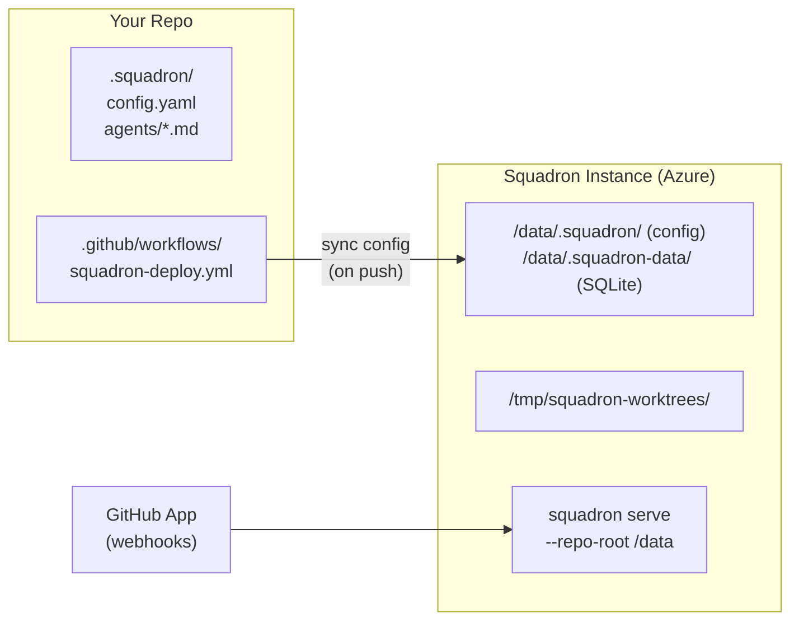

# Squadron Deployment

Squadron runs as a **standalone service** that receives GitHub webhooks and orchestrates AI agents against your repository. You don't install Squadron into your repo — you deploy an instance and point it at your repo via the GitHub App.

## Architecture



- **Your repo** contains `.squadron/` configuration (agent definitions, project settings)
- **A GitHub Actions workflow** (copied from our templates) deploys the Squadron container and syncs config
- **The deployed instance** receives webhooks from the GitHub App and orchestrates agents
- **Config sync** happens automatically when you push changes to `.squadron/`

## Onboarding a New Repo

1. **[Create a GitHub App](github-app-setup.md)** for your repo (one app per repo)
2. **Run `squadron init`** to scaffold `.squadron/` configuration
3. **Copy the deployment workflow template** into `.github/workflows/`
4. **Set repository secrets** (Azure credentials, GitHub App credentials)
5. **Run the workflow** to deploy
6. **Configure the webhook URL** in the GitHub App settings

Start with the [GitHub App setup guide](github-app-setup.md) — it walks through creating the app, generating credentials, and what secrets you'll need.

## Deployment Targets

| Target | Status | Directory |
|--------|--------|-----------|
| [Azure Container Apps](azure-container-apps/) | ✅ Supported | `deploy/azure-container-apps/` |

## Container Image

Squadron publishes a pre-built container image on every push to `main`:

```
ghcr.io/nbaertsch/squadron:latest
```

All deployment templates use this image by default. You never need to build your own.
